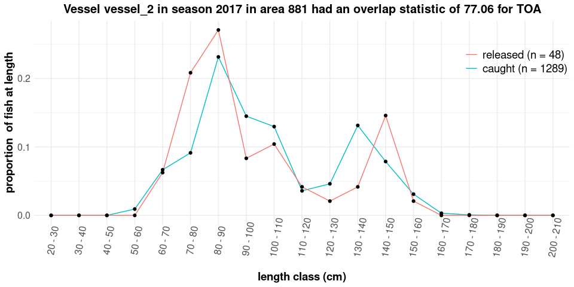

<!-- README.md is generated from README.Rmd. Please edit that file -->

# CCAMLRTOOLS

An R package for processing and visualizing official CCAMLR data
provided by the CCAMLR Secretariat to CCAMLR Members following the
procedure specified in the [Rules for Access and Use of CCAMLR
Data](https://www.ccamlr.org/en/document/publications/rules-access-and-use-ccamlr-data).

## Installation

Installing `CCAMLRTOOLS` requires installation of the `devtools`
package:

``` r
install.packages("devtools")
devtools::install_github("CCAMLR-Science/CCAMLRTOOLS")
```

## Documentation

<center>

### Table of contents

</center>

------------------------------------------------------------------------

1.  [Request and load CCAMLR data](#1-request-and-load-ccamlr-data)
2.  [Calculate Tag Overlap
    Statistic](#2-calculate-tag-overlap-statistic)

------------------------------------------------------------------------

## 1. Request and load CCAMLR data

Before you can use any of the functions in this package, you will need
to request and load the relevant CCAMLR data. CCAMLR data can be
requested following the procedures specified in the [Rules for Access
and Use of CCAMLR
Data](https://www.ccamlr.org/en/document/publications/rules-access-and-use-ccamlr-data).
Once permission to release the data has been obtained from the data
owners, the data will be extracted and provided you as an `.Rds` file
which can easily be imported into R using following code, in which you
replace `FILE_NAME.Rds` with the name of the `.Rds` file provided to
you.

``` r
ccamlr_data <- readRDS("FILE_NAME.Rds")
```

Then, load the package by typing:

``` r
library(CCAMLRTOOLS)
```

## 2. Calculate Tag Overlap Statistic

You can calculate the tag overlap statistic using the method specified
in [WG-SAM-2023/18](https://meetings.ccamlr.org/en/wg-sam-2023/18) and
[Annex 41-01/C](https://cm.ccamlr.org/en/measure-41-01) using the
function `tag_olap`.

The function `tag_olap` allows you to specify the `taxon` (*TOP or
TOA*), the CCAMLR fishing `seasons`, the `areas` (*the area, subarea or
division (asd), the research block (rb) or small scale research unit
(ssru)*), or fishing `vessels` (*name of the vessels*) for which you
would like to calculate the tag overlap statistic.

To start, lets use the demo data included in the package. Alternatively
if you received a CCAMLR data extract, you could load those data as
explained above.

``` r
ccamlr_data <- CCAMLRTOOLS::demo_data$olap
```

If for example you would like to calculate the tag overlap statistics
for all vessels during a specific fishing season in a specific area
(*e.g. SSRU 881A*) use the following code.

``` r
tag_olap(ccamlr_data = ccamlr_data, taxon = "TOA", seasons = c("2017"), areas = c("881A"))
```

| GROUP_ID | AREA | SEASON | SHIP_NAME | NATIONALITY_CODE | TAXON | LOGBOOK_ID | CATCH_TONNES | CATCH_N | MEASURED_N | TAGGED_N | RECAPTURED_N | TAG_RATE | TAG_OVERLAP |
|:---|:---|---:|:---|:---|:---|:---|---:|---:|---:|---:|---:|---:|---:|
| 2017_vessel_1_881A | 881A | 2017 | vessel_1 | XYZ | TOA | 15 | 4.1 | 163 | 158 | 17 | 1 | 4.1 | 69.34 |
| 2017_vessel_2_881A | 881A | 2017 | vessel_2 | XYZ | TOA | 12 | 15.1 | 1241 | 284 | 48 | 0 | 3.2 | 77.06 |
| 2017_vessel_3_881A | 881A | 2017 | vessel_3 | ABC | TOA | 11 | 11.2 | 489 | 233 | 18 | 1 | 1.6 | 65.68 |
| 2017_vessel_4_881A | 881A | 2017 | vessel_4 | CDE | TOA | 13 | 25.8 | 1250 | 289 | 28 | 0 | 1.1 | 65.35 |
| 2017_vessel_5_881A | 881A | 2017 | vessel_5 | CDE | TOA | 14 | 8.4 | 610 | 85 | 9 | 0 | 1.1 | 42.76 |

Alternatively, you can include a custom column in the C2 table that
identifies the areas for which you would like to calculate the overlap
statistic:

``` r
tag_olap(ccamlr_data = ccamlr_data, taxon = "TOA", seasons = c("2017"), areas = c("custom"), custom_areas = 'my_areas')
```

| GROUP_ID | AREA | SEASON | SHIP_NAME | NATIONALITY_CODE | TAXON | LOGBOOK_ID | CATCH_TONNES | CATCH_N | MEASURED_N | TAGGED_N | RECAPTURED_N | TAG_RATE | TAG_OVERLAP |
|:---|:---|---:|:---|:---|:---|:---|---:|---:|---:|---:|---:|---:|---:|
| 2017_vessel_1_area_1 | area_1 | 2017 | vessel_1 | XYZ | TOA | 15 | 5.4 | 180 | 69 | 7 | 1 | 1.3 | 52.56 |
| 2017_vessel_1_area_2 | area_2 | 2017 | vessel_1 | XYZ | TOA | 15 | 2.8 | 81 | 81 | 14 | 0 | 5.0 | 50.43 |
| 2017_vessel_1_area_3 | area_3 | 2017 | vessel_1 | XYZ | TOA | 15 | 3.9 | 189 | 135 | 11 | 1 | 2.8 | 57.08 |
| 2017_vessel_2_area_1 | area_1 | 2017 | vessel_2 | XYZ | TOA | 12 | 7.6 | 562 | 174 | 30 | 0 | 3.9 | 77.15 |
| 2017_vessel_2_area_2 | area_2 | 2017 | vessel_2 | XYZ | TOA | 12 | 7.7 | 455 | 68 | 14 | 0 | 1.8 | 40.27 |

If you would like to calculate the tag overlap statistics for a specific
vessel during a specific fishing season in a multiples areas (*e.g. SSRU
881A, RB 481_1 and asd 882*) use the following code.

``` r
tag_olap(ccamlr_data = ccamlr_data, taxon = "TOA", vessels = c("vessel_1"), 
         seasons = c("2017"), areas = c("881A", "481_1", "882"))
```

| GROUP_ID | AREA | SEASON | SHIP_NAME | NATIONALITY_CODE | TAXON | LOGBOOK_ID | CATCH_TONNES | CATCH_N | MEASURED_N | TAGGED_N | RECAPTURED_N | TAG_RATE | TAG_OVERLAP |
|:---|:---|---:|:---|:---|:---|:---|---:|---:|---:|---:|---:|---:|---:|
| 2017_vessel_1_481_1 | 481_1 | 2017 | vessel_1 | XYZ | TOA | 15 | 3.4 | 106 | 36 | 4 | 1 | 1.2 | 25.05 |
| 2017_vessel_1_881A | 881A | 2017 | vessel_1 | XYZ | TOA | 15 | 4.1 | 163 | 158 | 17 | 1 | 4.1 | 69.34 |
| 2017_vessel_1_882 | 882 | 2017 | vessel_1 | XYZ | TOA | 15 | 3.6 | 148 | 54 | 6 | 0 | 1.7 | 64.35 |

If you would like to calculate the tag overlap statistics for a specific
vessel during a specific fishing season for all areas for which CM 41-01
Annex C specifies a minimum overlap statistic, use the following code. A
tag overlap statistic value of NC indicates that no tag overlap
statistic was calculated because less than 30 fish were tagged.

``` r
tag_olap(ccamlr_data = ccamlr_data, taxon = "TOP", vessels = c("vessel_2"), 
         seasons = c("2017"), areas = c("CCEP"))
```

| GROUP_ID | AREA | SEASON | SHIP_NAME | NATIONALITY_CODE | TAXON | LOGBOOK_ID | CATCH_TONNES | CATCH_N | MEASURED_N | TAGGED_N | RECAPTURED_N | TAG_RATE | TAG_OVERLAP |
|:---|:---|---:|:---|:---|:---|:---|---:|---:|---:|---:|---:|---:|:---|
| 2017_vessel_2_882_4 | 882_4 | 2017 | vessel_2 | XYZ | TOP | 12 | 2.6 | 439 | 60 | 7 | 0 | 2.7 | NC |
| 2017_vessel_2_N70 | N70 | 2017 | vessel_2 | XYZ | TOP | 12 | 31.1 | 6028 | 214 | 30 | 5 | 1.0 | 67.5 |

The function also allows you to create a plot (*TRUE or FALSE*) showing
the length frequency distributions of the caught fish and the tagged and
released fish.

``` r
olap_toa <- tag_olap(ccamlr_data = ccamlr_data, taxon = "TOA", vessels = c("vessel_2"), 
                     seasons = c("2017"), areas = c("881"), plot = TRUE)
olap_toa$summary
olap_toa$plots$`2017_vessel_2_881`
```

| GROUP_ID | AREA | SEASON | SHIP_NAME | NATIONALITY_CODE | TAXON | LOGBOOK_ID | CATCH_TONNES | CATCH_N | MEASURED_N | TAGGED_N | RECAPTURED_N | TAG_RATE | TAG_OVERLAP |
|:---|:---|---:|:---|:---|:---|:---|---:|---:|---:|---:|---:|---:|---:|
| 2017_vessel_2_881 | 881 | 2017 | vessel_2 | XYZ | TOA | 12 | 15.1 | 1241 | 284 | 48 | 0 | 3.2 | 77.06 |

<!-- -->
